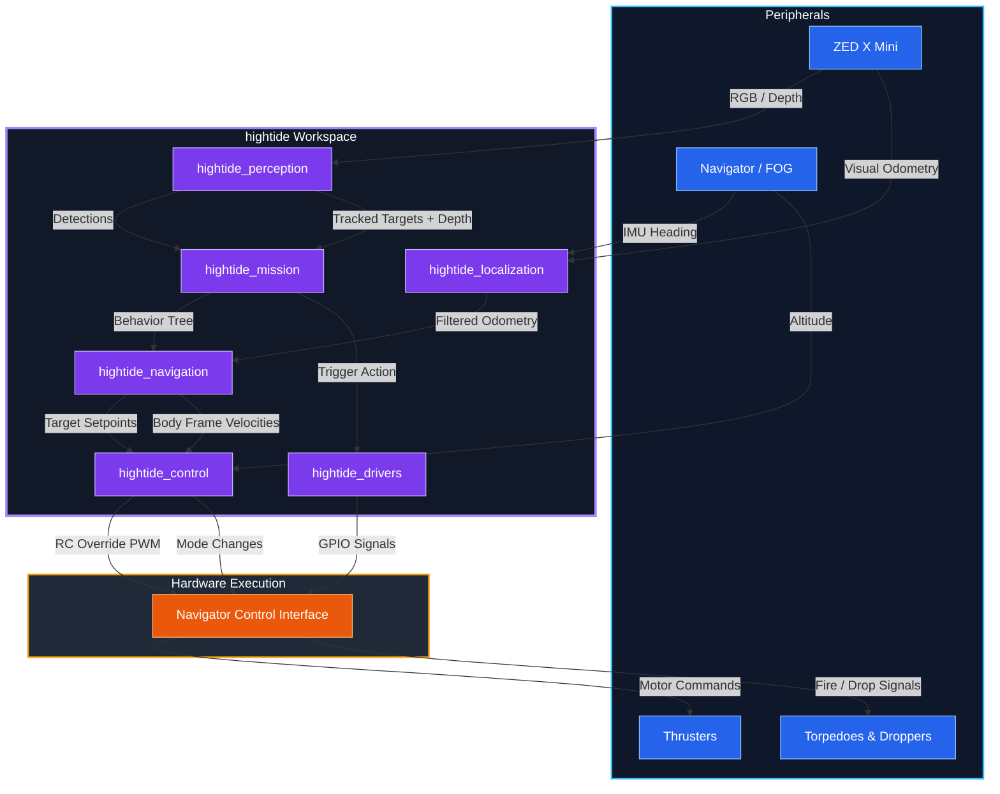

# 2026 hightide ROS2 Workspace

ROS2 Humble workspace for RoboSub 2026

## Hardware & Dependencies

hightide is built on a distributed hardware architecture combining high-level vision processing and low-level flight control:
* **Compute**: ZED Box Mini running Ubuntu 22.04.
* **Flight Controller**: Blue Robotics Navigator (with ArduSub).
* **Vision & VIO**: ZED X Mini Stereo Camera.
* **Navigation**: Fiber Optic Gyro (FOG) for drift-free heading reference.
* **Actuation**: Custom GPIO-triggered torpedo solenoids and marker droppers.

### Software Dependencies
Ensure the following are installed on the ZED Box Mini:
* **ROS2 Humble Desktop**
* **MAVROS**: `ros-humble-mavros` and `ros-humble-mavros-extras`
* **ZED ROS2 Wrapper**: Stereolabs ZED SDK
* **NVIDIA TensorRT**: Required for high-speed YOLOv8 inference
* **Python**: `py_trees` (Behavior Trees), `opencv-python`, `pytest`

---

## Software Architecture



---

## Workspace and Packages

```text
hightide_ws-2026/
├── src/
│   ├── control/         # RC Override mapping, Depth PID, Mode switching
│   ├── drivers/         # GPIO scripts for Torpedoes/Droppers
│   ├── interfaces/      # Custom ROS2 msg, srv, and action definitions
│   ├── launch/          # Master launch files, URDFs, and parameter configs
│   ├── localization/    # Sensor fusion (EKF) and Navigation Tier logic
│   ├── mission/         # Main Behavior Tree and task logic nodes
│   ├── navigation/      # Waypoint tracking, Crab Walk, Dead Reckoning
│   ├── perception/      # YOLOv8 TensorRT detection and target tracking
│   └── tests/           # Bench unit tests and in-water pool scripts
```

---

## Installation & Setup

### 1. Clone & Resolve Dependencies
Navigate to your workspace and install ROS2 dependencies using `rosdep`:
```bash
cd ~/HighTide_ws-2026
rosdep update
rosdep install --from-paths src --ignore-src -r -y
```

### 2. Build the Workspace
It is highly recommended to use `--symlink-install` for Python-heavy workspaces. This allows you to edit Python scripts in the `src/` directory without needing to rebuild every time.
```bash
colcon build --symlink-install
```

### 3. Sourcing the Workspace
ROS2 requires you to "source" the installation environment so it knows where your packages and nodes are. You must do this in *every* new terminal window before running hightide commands.
```bash
# Source the base ROS2 installation
source /opt/ros/humble/setup.bash

# Source the hightide workspace
source ~/HighTide_ws-2026/install/setup.bash
```
*(Tip: Add these lines to your `~/.bashrc` file to have them run automatically when you open a terminal).*

---

## Running the System

### Launching the Full System
To boot up the entire autonomous pipeline (Perception, Navigation, Control, and Mission), use the master launch file:
```bash
ros2 launch hightide_launch full_system.launch.py
```
This single command reads `params.yaml`, spawns the URDF transforms, and brings up every node in the correct order.

### Running Individual Packages
When debugging, you often want to run a single node instead of the whole system. You can do this using `ros2 run`:
```bash
# Example: Run only the YOLO detector
ros2 run hightide_perception yolo_detector_node

# Example: Run only the RC override mapping node
ros2 run hightide_control rc_override_node
```

### Launching in Simulation (Gazebo)
If you are testing logic without hardware, you can launch the system in simulation mode. This bypasses the GPIO drivers and visual hardware, assuming Gazebo will publish simulated camera feeds and odometry:
```bash
# Launch the system with the simulation flag set to true
ros2 launch hightide_launch full_system.launch.py use_sim_time:=true
```

---

## Parameter Tuning

Hardcoded magic numbers are strictly avoided. All configurable variables—PID gains, YOLO confidence thresholds, search pattern increments, and safety timeouts—are centralized in `src/launch/config/params.yaml`.

To tune the sub:
1. Open `params.yaml`.
2. Modify the desired value (e.g., changing `heading_kp` from `1.5` to `2.0`).
3. Save the file.
4. Restart the launch file (no rebuild required).

---

## Testing

The workspace includes a dedicated `hightide_tests` package containing two types of tests.

### 1. Bench Unit Tests
Run these offline to verify the math (PIDs, vector translations, bounding box intersections) and the logic (Behavior Tree routing, mock fallbacks).
```bash
# Run all unit tests
colcon test --packages-select hightide_tests

# View the results
colcon test-result --all
```

### 2. In-Water Pool Integration Tests
These are interactive Python scripts designed to be run while the sub is in the pool. They isolate hardware subsystems to ensure everything works before running the master behavior tree.

Ensure MAVROS and the core nodes are running, then in a separate terminal:
```bash
# Test 1: Verify GPIO firing
ros2 run hightide_tests pool_test_actuators

# Test 2: Verify motor mappings (Surge, Sway, Heave, Yaw)
ros2 run hightide_tests pool_test_thrusters

# Test 3: Validate Alt-Hold and PID depth tuning
ros2 run hightide_tests pool_test_depth

# Test 4: Monitor FOG and VIO drift
ros2 run hightide_tests pool_test_sensors

# Test 5: Test closed-loop distance waypoints
ros2 run hightide_tests pool_test_navigation
```
